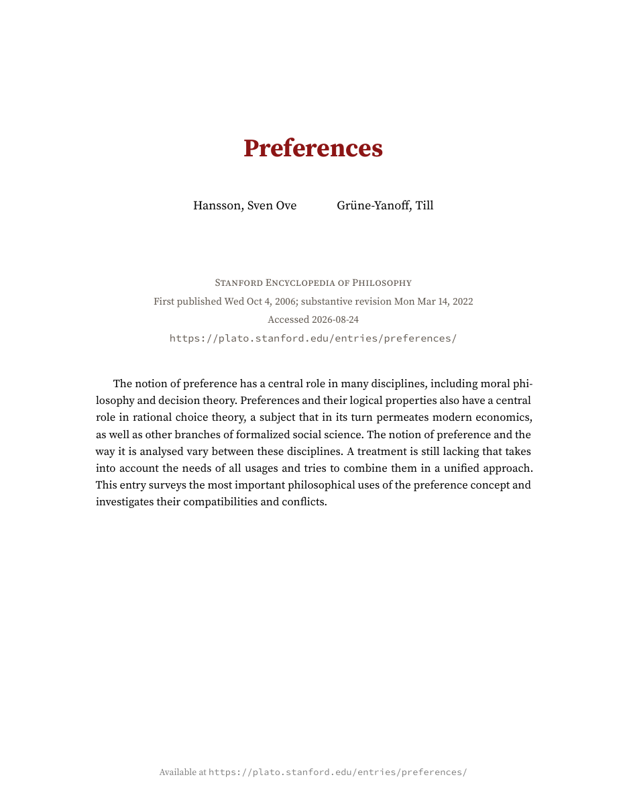
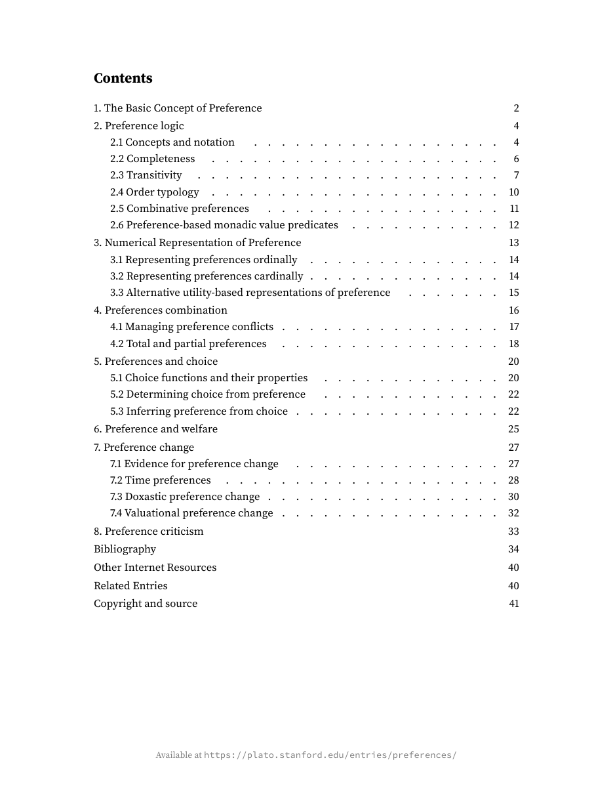
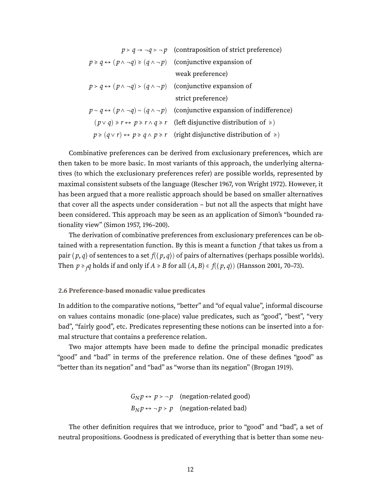

# SEP2PDF

## Purpose

SEP2PDF is a standalone Codex skill that downloads a current or archived [Stanford Encyclopedia of Philosophy](https://plato.stanford.edu/) entry and produces a polished, source-attributed PDF for personal scholarly use. It preserves the entry's substantive text, notes, bibliography, metadata, mathematics, figures, and tables while omitting website navigation and utilities. The finished document includes publication history, authorship, canonical source URL, access date, copyright, and a generated contents page. SEP2PDF is unofficial, open-source software and is not affiliated with, endorsed by, or maintained by Stanford University or the Stanford Encyclopedia of Philosophy.

## Preview

The following pages come from the skill's validated rendering of [“Preferences”](https://plato.stanford.edu/entries/preferences/) (revision dated 14 March 2022).



*Complete title page.*



*Complete table-of-contents page.*



*Complete mathematics-heavy article page; no table is shown.*

## Installation

Ask Codex:

```text
Use $skill-installer to install https://github.com/haihan-yu/SEP2PDF/tree/main/sep-article-pdf
```

For a manual installation, copy `sep-article-pdf` into `$CODEX_HOME/skills/sep-article-pdf` (normally `~/.codex/skills/sep-article-pdf`). Restart Codex or begin a new task if the skill is not discovered immediately. The repository follows the current [OpenAI standalone skill structure](https://learn.chatgpt.com/docs/build-skills).

Installation copies only the reusable skill. The preview images and repository documentation are not needed at runtime.

## Requirements

- Python 3.9+ with `requests` and `beautifulsoup4` (`pip install -r requirements.txt`)
- Pandoc 2.18+
- Full TeX Live or MacTeX 2024+ with XeLaTeX and `latexmk`
- Poppler (`pdfinfo`, `pdftotext`, and `pdftoppm`)
- Inkscape or `rsvg-convert` when an entry contains SVG figures; macOS Quick Look is supported as a fallback

Dependencies are checked and never installed silently. A successful build is structurally and textually validated, and its temporary download, TeX, rendering, and audit files are removed automatically on both success and failure.

## Use

Give Codex an SEP URL, slug, or title:

```text
$sep-article-pdf download https://plato.stanford.edu/entries/preferences/
```

The underlying command-line interface is:

```text
python3 sep-article-pdf/scripts/build_sep_pdf.py SEP_URL_OR_SLUG [--output PDF_PATH] [--overwrite]
```

By default, the skill places one descriptively named PDF in the current task folder. Existing PDFs are preserved through numbered filenames unless `--overwrite` is explicitly supplied.

## SEP rights and license

> **Important:** Generated PDFs must be used in accordance with the [SEP Terms of Use](https://plato.stanford.edu/info.html#c). Public electronic redistribution is restricted. Keep each entry's author copyright, attribution, citation information, and source URL intact.

 SEP2PDF's original code is released under the [MIT License](LICENSE). Its document design adapts Pascal Michaillat's [`latex-paper`](https://github.com/pmichaillat/latex-paper).
